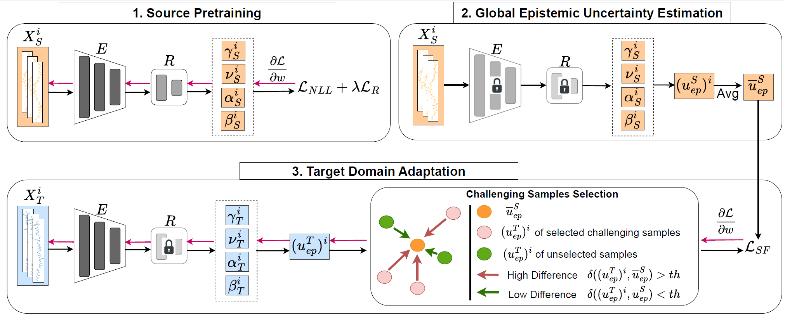

# Source-free Calibrated Uncertainty for RUL Adaptation with Incomplete Degradation [[Paper](https://www.sciencedirect.com/science/article/abs/pii/S0888327025004194)]
#### *by: Yubo Hou, Yucheng Wang, Min Wu, Chee-Keong Kwoh, Xiaoli Li, Zhenghua Chen*
#### Mechanical Systems and Signal Processing (MSSP-25).

This is a PyTorch implementation of this domain adaptation method for remaining useful life prediction on time series data.

## Abstract

Effective remaining useful life prediction in the absence of target domain labels relies heavily on domain adaptation to transfer knowledge from a labeled source domain to an unlabeled target domain. However, privacy concerns in industries such as aerospace and manufacturing often render source data inaccessible due to the confidentiality of degradation information. Furthermore, existing source-free DA methods face significant challenges when applied to target domains with incomplete degradation trajectories, which can severely hinder their performance in RUL prediction tasks.
To address these challenges, we propose a novel Calibrated Uncertainty for RUL Adaptation method, CURA, designed to enable source-free RUL prediction. Our approach begins with pretraining a model on the source domain using evidential learning to estimate both RUL values and associated uncertainties. The model is then adapted to the target domain by calibrating its uncertainty, ensuring consistency in uncertainty levels between the source and target domains while dynamically focusing on challenging samples. To determine when to stop training without target labels, we introduce a termination criterion based on the number of remaining challenging samples.
Extensive experiments on the C-MAPSS and N-CMAPSS datasets demonstrate that CURA achieves superior performance, surpassing state-of-the-art source-free methods by an average of 69% on C-MAPSS and 53% on N-CMAPSS. Remarkably, CURA also outperforms state-of-the-art non-source-free methods by an average of 23% on C-MAPSS and 3% on N-CMAPSS, highlighting its exceptional effectiveness for source-free RUL adaptation.

## Requirmenets:
- Python3.x
- Pytorch==1.12.1
- Numpy
- Sklearn
- Pandas

## Processed dataset
Processed dataset can be accessed via [link](https://drive.google.com/drive/folders/1K93Ro9OsYUh-YhNBYUQxGZ8PZlV-b2bv?usp=sharing)

## Train the model
To pre train model:

```
python pretrain_main.py 
```
To train model for domain adaptation:

```
python main_cross_domains.py --da_method CURA --dataset [dataset]    
```

## Citation
If you found this work useful for you, please consider citing it.
```
@article{HOU2025112718,
title = {Source-free Calibrated Uncertainty for RUL Adaptation with incomplete degradation},
journal = {Mechanical Systems and Signal Processing},
volume = {233},
pages = {112718},
year = {2025},
}
```
